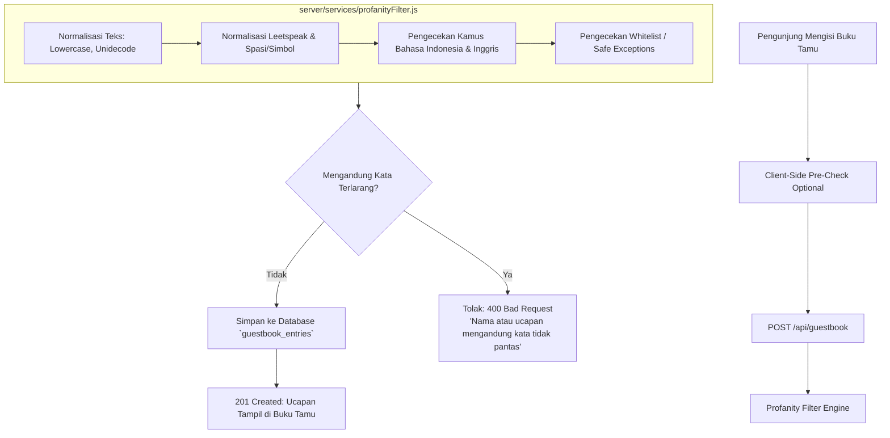

# 📋 Rencana Implementasi: Filter Kata Kasar & Komentar Tidak Pantas (Buku Tamu)

Dokumen ini berisi rencana komprehensif implementasi sistem moderasi dan penyaringan kata kasar (*profanity & bad word filter*) untuk Buku Tamu (*Guestbook*) di platform **Wedding Summer** (`marryme.web.id` dan seluruh subdomain undangan).

---

## 🎯 1. Tujuan & Kriteria Keberhasilan

1. **Pencegahan Konten Tidak Pantas**:
   - Memblokir pengiriman ucapan atau nama pengirim yang mengandung kata-kata jorok, vulgar, seksual, hinaan, makian, dan SARA baik dalam **Bahasa Indonesia** maupun **Bahasa Inggris**.
2. **Pendeteksian Variasi & Trik Evasion (Anti-Bypass)**:
   - Mampu mendeteksi variasi *leetspeak* (angka pengganti huruf, misal `k0nt0l`, `f*ck`, `b1tch`).
   - Mampu mendeteksi pemisahan spasi atau simbol (misal `k o n t o l`, `k.o.n.t.o.l`, `f u c k`).
   - Mampu mendeteksi pengulangan huruf (misal `kooontoolll`, `fuuuuuck`).
3. **Bebas False Positive (*Scunthorpe Problem*)**:
   - Kata-kata aman dan umum dalam konteks pernikahan tidak boleh terblokir secara keliru (contoh: *"Assalamu'alaikum"*, *"kontak"*, *"konsultasi"*, *"selamat"*, *"bahagia"*).
4. **Keamanan & Performa**:
   - Validasi utama berjalan di **Server-Side (Node.js API)** sehingga tidak bisa dibobol lewat manipulasi inspect element / API request langsung.
   - Respon penolakan ramah dan informatif ke pengguna di UI.
   - Tidak berdampak pada performa website 3D maupun subdomain lain.

---

## 🏗️ 2. Arsitektur & Komponen Sistem

---

## 📑 3. Rincian Kamus & Kategori Kata Terlarang

### A. Bahasa Indonesia
- **Alat Kelamin / Seksual**: *kontol, memek, jembut, pepek, itil, ngentot, ewita, tetek, toket, entot, peli, peler, bokep, porn, bugil, bokong, ngocok, coli, crot, pejuh*.
- **Makian & Hewan Penghina**: *anjing, babi, bangsat, bajingan, kampret, pantek, puki, pukimak, suwe, bodoh, tolol, bego, idiot, sinting, gila, bejad, setan, iblis, dajjal*.
- **Pelecehan / Prostitusi**: *lonte, perek, pelacur, jablay, bencong, banci, sundal, germo*.

### B. Bahasa Inggris
- **Profanity & Vulgar**: *fuck, fucker, fucking, shit, bullshit, bitch, cunt, asshole, bastard, damn, dick, cock, pussy, boobs, tits, porn, blowjob, handjob, dildo, slut, whore*.
- **Hate Speech / Slurs**: *nigger, nigga, faggot, retard*.

### C. Daftar Pengecualian Aman (*Whitelist*)
- Kata-kata yang mengandung substring terlarang namun sah:
  - *kontak* (mengandung "kon")
  - *konsultasi, kondisi, konser*
  - *assalamualaikum, assalam* (mengandung "ass")
  - *passionate, compass, class* (mengandung "ass")
  - *membina, bimbingan*

---

## 🛠️ 4. Rencana File yang Dibuat & Dimodifikasi

| No | File | Jenis Perubahan | Deskripsi |
|:---|:---|:---|:---|
| 1 | `server/services/profanityFilter.js` | **File Baru** | Modul engine pendeteksi kata kasar, kamus kata ID + EN, aturan normalisasi leetspeak, dan whitelist. |
| 2 | `server/services/profanityFilter.test.js` | **File Baru** | Automated unit test suite untuk menguji >40 skenario (kata langsung, leetspeak, spasi, pengulangan, serta kalimat aman). |
| 3 | `server/routes/guestbook.js` | **Modifikasi** | Menambahkan middleware/filter pengecekan pada field `name` dan `message` sebelum query SQL INSERT. |
| 4 | `src/lib/services/api.ts` | **Modifikasi** | Menangkap error response spesifik dari server dan mengembalikannya ke UI. |
| 5 | `src/lib/components/ui/GuestbookModal.svelte` | **Modifikasi** | Menampilkan pesan error spesifik jika pengiriman gagal akibat kata tidak pantas. |

---

## 🧪 5. Skenario Pengujian (*Test Cases*)

### Test Case 1: Kata Terlarang Langsung
- Input: `name: "Budi"`, `message: "Selamat ya kontol"` ➔ **DITOLAK (400)**
- Input: `name: "Fuck You"`, `message: "Happy wedding"` ➔ **DITOLAK (400)**

### Test Case 2: Trik Evasion (Leetspeak / Simbol / Spasi)
- Input: `message: "K.O.N.T.O.L"` ➔ **DITOLAK (400)**
- Input: `message: "k 0 n t 0 l"` ➔ **DITOLAK (400)**
- Input: `message: "f*ck this wedding"` ➔ **DITOLAK (400)**
- Input: `message: "ng3nt000t"` ➔ **DITOLAK (400)**

### Test Case 3: Ucapan Bersih & Selamat (False Positive Prevention)
- Input: `message: "Selamat menempuh hidup baru Kia & Toni!"` ➔ **DITERIMA (201)**
- Input: `message: "Assalamu'alaikum, semoga menjadi keluarga sakinah mawaddah warahmah."` ➔ **DITERIMA (201)**
- Input: `message: "Nanti saya hubungi via kontak ya."` ➔ **DITERIMA (201)**

---

## 🚀 6. Tahapan Eksekusi & Deployment

1. **Tahap 1: Pembuatan Engine & Kamus** (`server/services/profanityFilter.js`)
2. **Tahap 2: Pengujian Unit Test Lokal** (`npm test` di server) sampai 100% PASS.
3. **Tahap 3: Integrasi API Endpoint** (`server/routes/guestbook.js`).
4. **Tahap 4: Update Error Handling UI** (`GuestbookModal.svelte` & `api.ts`).
5. **Tahap 5: Verifikasi Frontend Build** (`npm run check` & `npm run build`).
6. **Tahap 6: Commit & Push ke Staging**.
7. **Tahap 7: Deploy ke VPS** (`git pull origin staging && docker compose up -d --build`).
8. **Tahap 8: Verifikasi Live** (Uji coba kirim ucapan via `https://marryme.web.id` dan subdomain).

---

## 🛡️ 7. Jaminan Keamanan Sistem

- ✅ **Isolasi Database**: Hanya memfilter validasi input teks, tidak mengubah skema tabel database.
- ✅ **Rollback Ready**: Semua perubahan tercatat dalam git commit terpisah dan dapat di-rollback kapan saja.
- ✅ **Performa Ringan**: Engine menggunakan Regular Expression terkompilasi dan lookup hash Set (`O(1)`), waktu eksekusi < 1 milidetik per request.
