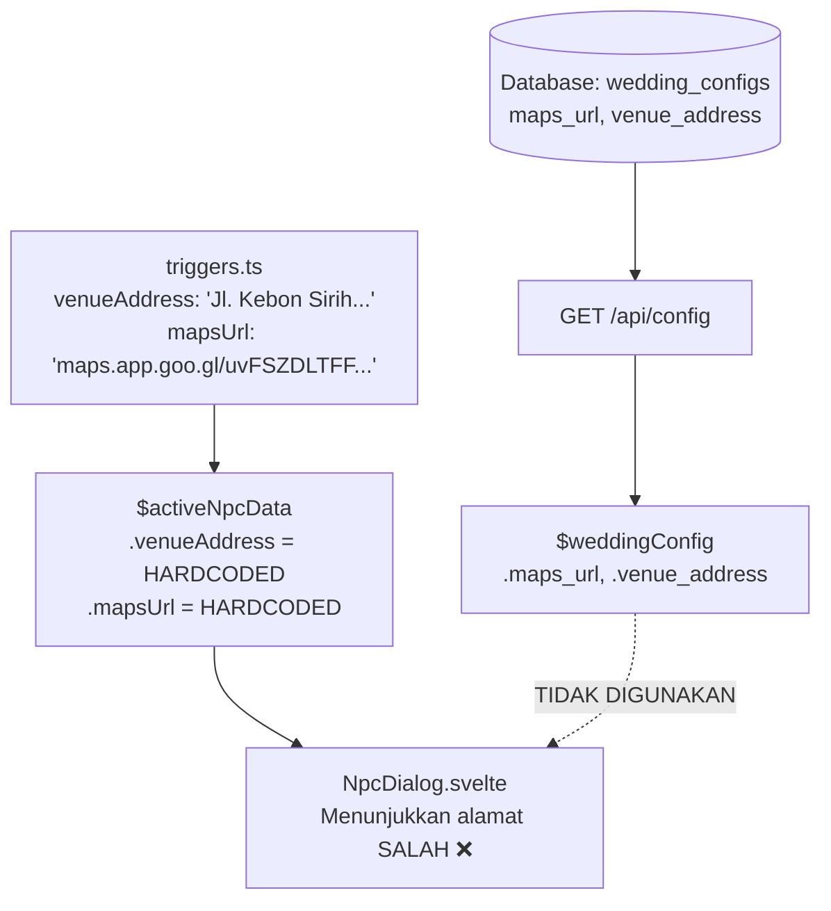
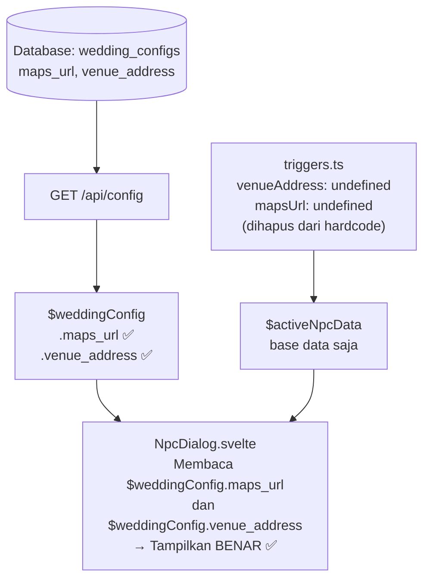

# 📋 Plan: Perbaikan Alamat & Maps Resepsionis — Dynamic dari Wedding Config

> **Status masalah:** KRITIS — Tombol "Buka Maps" dan teks alamat di dialog Resepsionis selalu menampilkan data hardcoded (*Jl. Kebon Sirih*) milik tenant demo, bukan alamat resepsi/akad nyata milik tenant yang sedang dibuka.

---

## 🔍 1. Analisis Akar Masalah (Root Cause)

### Alur Data Saat Ini (Bermasalah)



### Detail Teknis

Masalah ada di 2 tempat:

**1. `src/lib/constants/triggers.ts` (baris 34–35)**
```ts
// MASALAH: alamat & URL maps di-hardcode statis di sini
venueAddress: 'Jl. Kebon Sirih No.17, RT.14/RW.7, Gambir...',
mapsUrl: 'https://maps.app.goo.gl/uvFSZDLTFFYxuwGP7'
```

**2. `src/lib/components/ui/NpcDialog.svelte` (baris 51, 64)**
```svelte
<!-- Hanya menggunakan data dari $activeNpcData (hardcoded), 
     tidak pernah membaca $weddingConfig.venue_address / maps_url -->
<a href={$activeNpcData.mapsUrl}>
  {parseText($activeNpcData.venueAddress)}
</a>
```

### Data yang Sudah Ada dan Benar

Di database (`wedding_configs`) dan store `$weddingConfig`, sudah ada field:

| Field DB | Field Frontend Store | Isi Contoh (riskaroni) |
|:---|:---|:---|
| `venue_address` | `$weddingConfig.venue_address` | `"Jl. Simpang Ranugrati Selatan No.37C Rt.03 Rw.06 Sawojajar, Kota Malang"` |
| `maps_url` | `$weddingConfig.maps_url` | URL Google Maps nyata milik Riska & Roni |

---

## ✅ 2. Solusi

### Alur Data Setelah Perbaikan (Benar)



---

## 🛠️ 3. File yang Diubah

| No | File | Jenis Perubahan | Detail |
|:---|:---|:---|:---|
| 1 | `src/lib/constants/triggers.ts` | **Modifikasi** | Hapus `venueAddress` dan `mapsUrl` dari data NPC Resepsionis (baris 34–35). Field ini sekarang tidak perlu karena nilainya diambil dari `$weddingConfig`. |
| 2 | `src/lib/components/ui/NpcDialog.svelte` | **Modifikasi** | Ganti `$activeNpcData.venueAddress` dan `$activeNpcData.mapsUrl` menjadi `$weddingConfig.venue_address` dan `$weddingConfig.maps_url`. |

---

## 📝 4. Perubahan Kode Spesifik

### File 1: `src/lib/constants/triggers.ts`

```diff
   npcData: {
     name: 'Resepsionis',
     avatar: '🛎',
     messages: [
       'Selamat datang di pernikahan\n👰🏻 {bride} & 🤵🏻 {groom}!\nSilakan berjalan ke arah pelaminan.',
       'Jangan lupa memberikan ucapan 💌 di kotak ucapan ya! 📮'
     ],
-    venueAddress: 'Jl. Kebon Sirih No.17, RT.14/RW.7, Gambir, Kec. Menteng, Kota Jakarta Pusat, Daerah Khusus Ibukota Jakarta 10340',
-    mapsUrl: 'https://maps.app.goo.gl/uvFSZDLTFFYxuwGP7'
   }
```

### File 2: `src/lib/components/ui/NpcDialog.svelte`

```diff
- {#if currentMessageIndex === 0 && ($activeNpcData.venueAddress || $activeNpcData.mapsUrl)}
+ {#if currentMessageIndex === 0 && ($weddingConfig.venue_address || $weddingConfig.maps_url)}
    <a
-     href={$activeNpcData.mapsUrl}
+     href={$weddingConfig.maps_url || undefined}
-     class:opacity-60={!$activeNpcData.mapsUrl}
+     class:opacity-60={!$weddingConfig.maps_url}
-     aria-disabled={!$activeNpcData.mapsUrl}
+     aria-disabled={!$weddingConfig.maps_url}
      ...
    >
      ...
-     {parseText($activeNpcData.venueAddress) || 'Alamat belum tersedia.'}
+     {$weddingConfig.venue_address || 'Alamat belum tersedia.'}
      ...
-     {#if $activeNpcData.mapsUrl}<span>Buka Maps</span>{/if}
+     {#if $weddingConfig.maps_url}<span>Buka Maps</span>{/if}
    </a>
  {/if}
```

---

## 🔒 5. Jaminan Keamanan

- ✅ **Tidak Mengubah Database**: Tidak ada perubahan skema tabel sama sekali.
- ✅ **Tidak Mengubah API Server**: Field `maps_url` dan `venue_address` sudah ada dan sudah dikembalikan oleh API `/config`, tidak perlu perubahan backend.
- ✅ **Tidak Menyentuh Fitur Lain**: Perubahan terbatas pada 2 file frontend saja, tidak menyenggol buku tamu, admin panel, atau fitur 3D lainnya.
- ✅ **Rollback Mudah**: Perubahan sangat minimal (2 file, < 10 baris), mudah di-revert jika diperlukan.
- ✅ **Graceful Fallback**: Jika `venue_address` atau `maps_url` kosong di database, section peta tidak ditampilkan sama sekali (tidak crash).

---

## 🚀 6. Tahapan Eksekusi

1. Edit `triggers.ts` → hapus 2 baris hardcoded.
2. Edit `NpcDialog.svelte` → baca dari `$weddingConfig` bukan `$activeNpcData`.
3. Jalankan `npm run check` (typecheck).
4. Jalankan `npm run build` (verifikasi build).
5. Commit + push ke `staging`.
6. Deploy di VPS.
7. Verifikasi live di `riskaroni.marryme.web.id` dan `raidika.marryme.web.id`.
