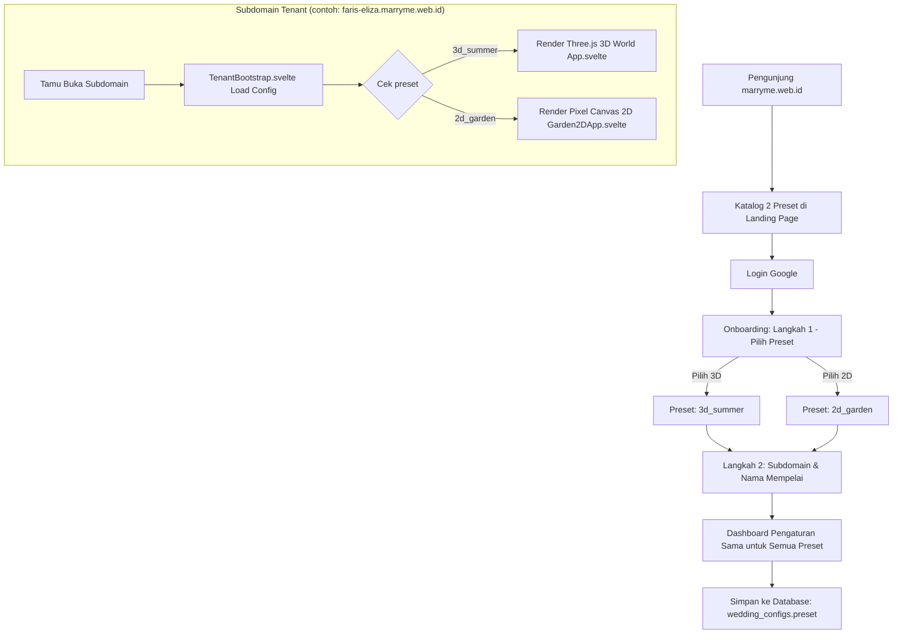

# Rencana Desain Katalog 2 Preset & Arsitektur Dunia 2D / 3D MarryMe

## 1. Ringkasan Kebutuhan
User ingin memperbarui halaman utama **marryme.web.id** dengan menambahkan showcase katalog 2 preset/desain:
1. **Preset 1 (Dunia 3D - Summer Fantasy Island)**: Desain 3D Three.js yang sudah berjalan saat ini (contoh: `kia-toni.marryme.web.id`).
2. **Preset 2 (Dunia 2D - Pixel Garden RPG)**: Desain 2D Pixel Art Top-Down RPG yang sangat ringan dan nostalgia (dari file `preset/wedding-garden-2.html`).

Serta mengubah teks tagline:
- **Sebelum**: *"Pengalaman berkesan & tak terlupakan dengan dunia 3 dimensi"*
- **Sesudah**: *"Desain terpopuler kami di dunia fantasi.."*
- Di bawahnya menampilkan katalog 2 preset dengan preview mockup HP & laptop.

---

## 2. Analisis & Jawaban: "Apakah Pengaturan Setelah Login Bakal Banyak Ngerombak?"

### **Jawaban Singkat: TIDAK PERLU MEROMBAK BANYAK! 🚀**
Kita **TIDAK PERLU** membuat dashboard terpisah atau membuat halaman admin baru untuk 2D. 

### **Alasan Mengapa Sistem Saat Ini Sangat Cocok (100% Shared Data Model):**
Kedua dunia (3D maupun 2D) membutuhkan data pernikahan yang **sama persis**:
| Data Pernikahan | Digunakan di 3D | Digunakan di 2D Pixel Garden |
| :--- | :---: | :---: |
| **Nama Mempelai & Ortu** | Panggung Pelaminan / Resepsionis | Title Header / Papan Selamat Datang |
| **Foto Pengantin & Galeri** | Stand Galeri Foto 3D | Pop-up Galeri Foto Pixel Art |
| **Akad & Resepsi (Waktu & Lokasi)** | Dialog NPC & Panggung | Dialog Informasi Pernikahan & Papan Altar |
| **Google Maps & Alamat** | Tombol Navigasi Maps | Tombol "Buka Google Maps" di dialog lokasi |
| **Amplop Digital (Bank & QRIS)** | NPC Amplop Digital / Modal | Tombol Amplop / Dialog Hadiah |
| **Backsound Musik** | Audio Player 3D | NPC Pianis & Penyanyi di danau |
| **Buku Tamu / Ucapan** | NPC Meja Tamu | Dialog Buku Tamu & Form Ucapan |

---

## 3. Desain Arsitektur Sistem (Zero-Disruption Strategy)



### **1. Database & Backend (Hanya Tambah 1 Kolom)**
- Tambahkan kolom `preset` pada tabel `wedding_configs` (atau `invitations`):
  ```sql
  ALTER TABLE wedding_configs 
  ADD COLUMN preset VARCHAR(32) NOT NULL DEFAULT '3d_summer';
  ```
- Nilai yang didukung:
  - `'3d_summer'` (Default, semua subdomain lama tetap 3D tanpa kendala).
  - `'2d_garden'` (Subdomain baru atau yang memilih tema 2D).

### **2. Alur Onboarding Setelah Login**
1. **Langkah 1 (Pilih Desain)**: Tampilkan 2 kartu visual (3D World vs 2D Pixel Garden).
2. **Langkah 2 (Subdomain & Mempelai)**: Input nama subdomain (misal `faris-eliza`), nama mempelai pria & wanita.
3. **Selesai**: Langsung masuk ke Dashboard.

### **3. Di Dashboard Pengaturan Pengguna**
- Form editor tetap sama (Mempelai, Acara, Lokasi, Galeri, Amplop, Musik, Tamu).
- Di tab **Pengaturan**, tambahkan switcher tema: *"Tema Aktif: [ 3D Island | 2D Pixel Garden ]"*. Pengguna bisa ganti tema kapan saja dalam 1 klik tanpa kehilangan data!

### **4. Di Sisi Subdomain (Tamu Masuk)**
- Di `src/lib/components/tenant/TenantBootstrap.svelte`:
  ```svelte
  {#if $configStatus === 'ready'}
    {#if $weddingConfig?.preset === '2d_garden'}
      <Garden2DApp config={$weddingConfig} />
    {:else}
      <ThreeDApp config={$weddingConfig} />
    {/if}
  {/if}
  ```
- **Keuntungan Besar**:
  - Untuk tema 2D, browser tidak perlu mendownload Three.js dan asset 3D GLTF (~15MB), sehingga **load instan (< 1 detik)** di HP manapun.
  - Untuk tema 3D, berjalan normal seperti sekarang.

---

## 4. Desain Tampilan Baru `marryme.web.id` (Landing Page)

### **A. Bagian Hero & Tagline**
- **Heading**:
  > *Buat undangan yang terasa seperti **dunia kalian sendiri**.*
- **Sub-heading (Baru)**:
  > *Desain terpopuler kami di dunia fantasi..*

### **B. Showcase Katalog 2 Preset (Mockup Laptop & HP)**
Menampilkan grid 2 kartu preset yang interaktif dan mewah:

#### 🎮 **Preset 01: 3D Fantasy Island (Summer Garden)**
- **Badge**: `🌟 3D Immersive World` • `Three.js`
- **Visual**: Mockup frame laptop & HP yang menampilkan pulau 3D, avatar berjalan, dan panggung pelaminan.
- **Poin Keunggulan**:
  - Eksplorasi 3D orang ketiga (Third-person view).
  - Karakter 3D animasi dengan pilihan pakaian/kebaya.
  - Panggung pelaminan interaktif & efek confetti.
  - Sangat memukau untuk tamu yang suka pengalaman modern.
- **Tombol**: `Lihat Demo 3D (kia-toni.marryme.web.id)` & `Pilih Desain Ini`

#### 🌿 **Preset 02: 2D Pixel Garden RPG (Ultra-Lightweight)**
- **Badge**: `⚡ Ultra Ringan & Nostalgia` • `Retro Pixel Art`
- **Visual**: Mockup frame laptop & HP dari screenshot `preset/wedding-garden-2.html` (air mancur, jembatan danau, pianis & penyanyi, panggung akad).
- **Poin Keunggulan**:
  - Ukuran sangat ringan, buka cepat di semua jenis HP & kuota hemat.
  - Joystick analog & navigasi jalan setapak yang mulus.
  - Detail romantis: air terjun beriak, animasi pianis, taman bunga.
  - Cocok untuk pasangan pecinta retro game atau keluarga besar.
- **Tombol**: `Lihat Demo 2D (Garden RPG)` & `Pilih Desain Ini`

---

## 5. Rencana Tahapan Eksekusi (Implementation Phases)

### **Fase 1: Tampilan Katalog di Landing Page (Fokus Utama Sekarang)**
1. Update teks tagline pada `src/lib/components/platform/DashboardShell.svelte` & `dashboard.css`.
2. Siapkan aset gambar mockup untuk Preset 1 (3D) dan Preset 2 (2D) di `static/media/` menggunakan screenshot dari folder `preset/`.
3. Buat komponen katalog kartu interaktif 2 Preset dengan mockup perangkat (Laptop + Mobile).
4. Tambahkan tombol Live Demo untuk kedua preset.

### **Fase 2: Komponen Game Engine 2D Svelte (`Garden2DApp.svelte`)**
1. Porting script dan canvas rendering dari `preset/wedding-garden-2.html` ke Svelte component:
   - Bersihkan dan pisahkan aset base64 gambar/audio ke folder `static/preset-2d/` agar kode rapi dan ringan.
   - Sambungkan data teks (nama pengantin, jadwal, lokasi akad/resepsi, galeri, buku tamu) ke `$weddingConfig`.
   - Sambungkan pengiriman ucapan buku tamu ke API backend `/api/guestbook`.

### **Fase 3: Database & Backend Integration**
1. Buat migration database `012_add_preset_to_configs.sql`.
2. Update backend route `server/routes/invitations.js` dan `server/routes/tenant-config.js` untuk menerima dan mengembalikan field `preset`.

### **Fase 4: Onboarding Wizard & Theme Switcher**
1. Tambahkan langkah pemilihan preset pada `OnboardingWizard.svelte` saat pengguna pertama kali membuat undangan setelah login.
2. Tambahkan pilihan ubah preset di tab Pengaturan Dashboard.

### **Fase 5: Testing Lokal & Verifikasi**
1. Uji tampilan landing page di desktop dan mobile.
2. Uji alur login Google -> Onboarding pilih 2D -> Isi data -> Buka subdomain 2D.
3. Uji beralih preset dari 3D ke 2D dan sebaliknya.
