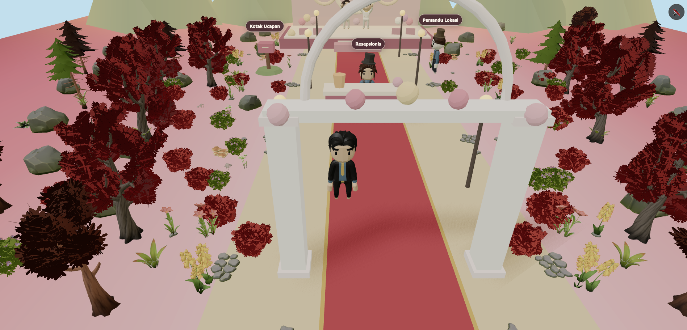
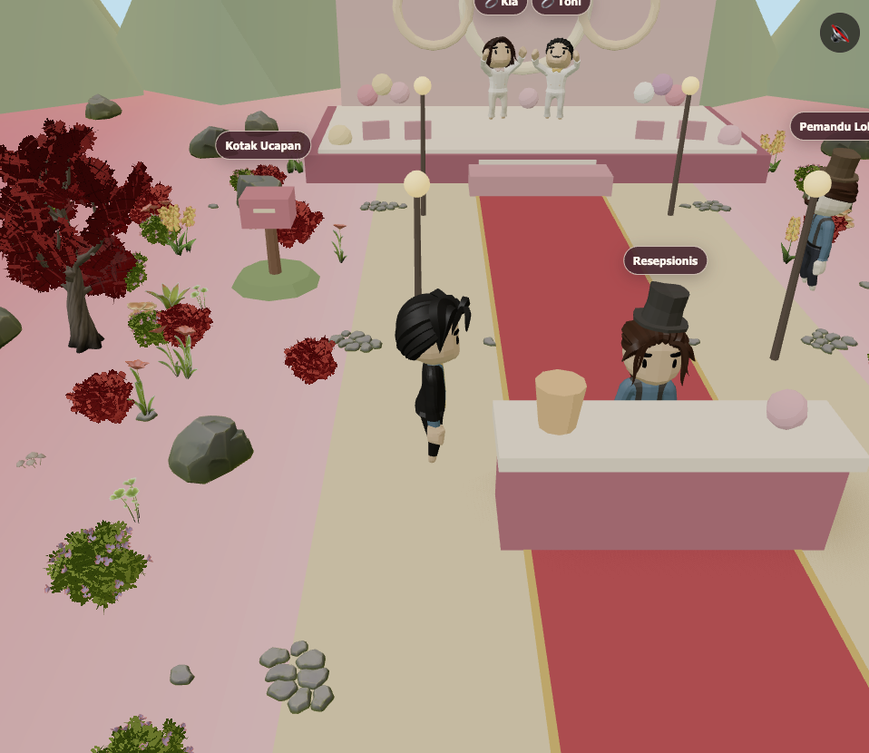
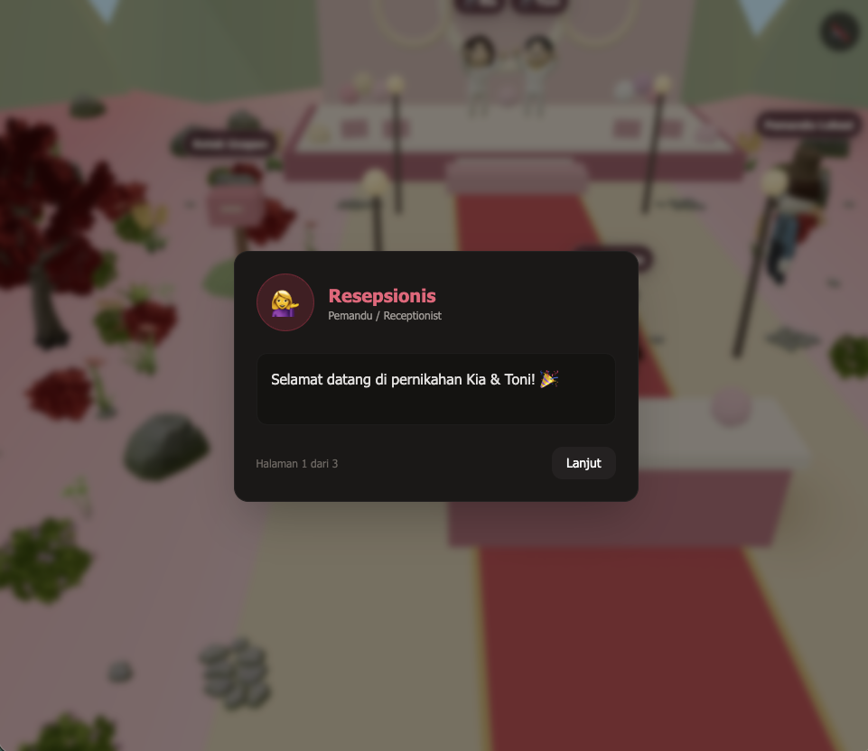
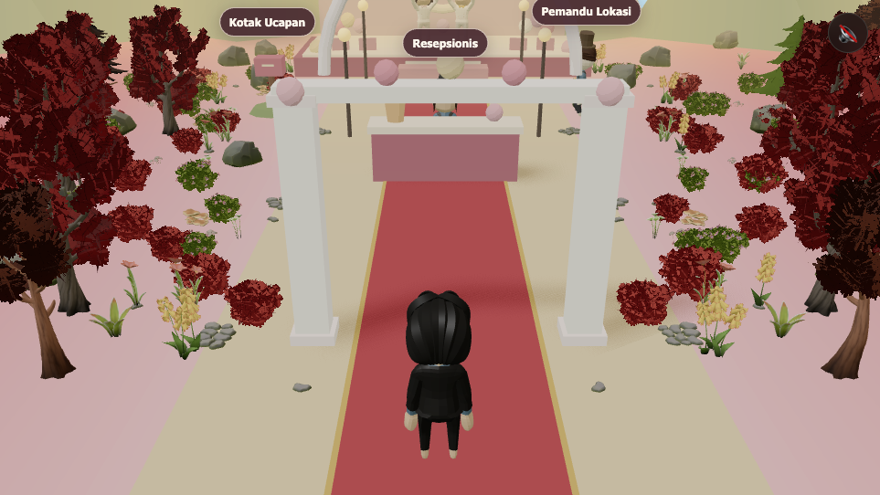
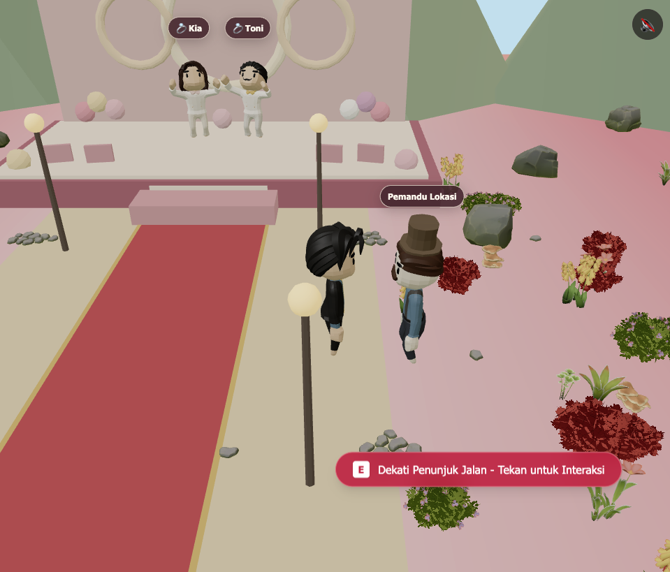
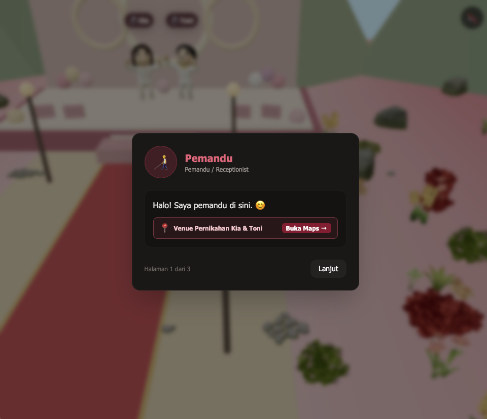
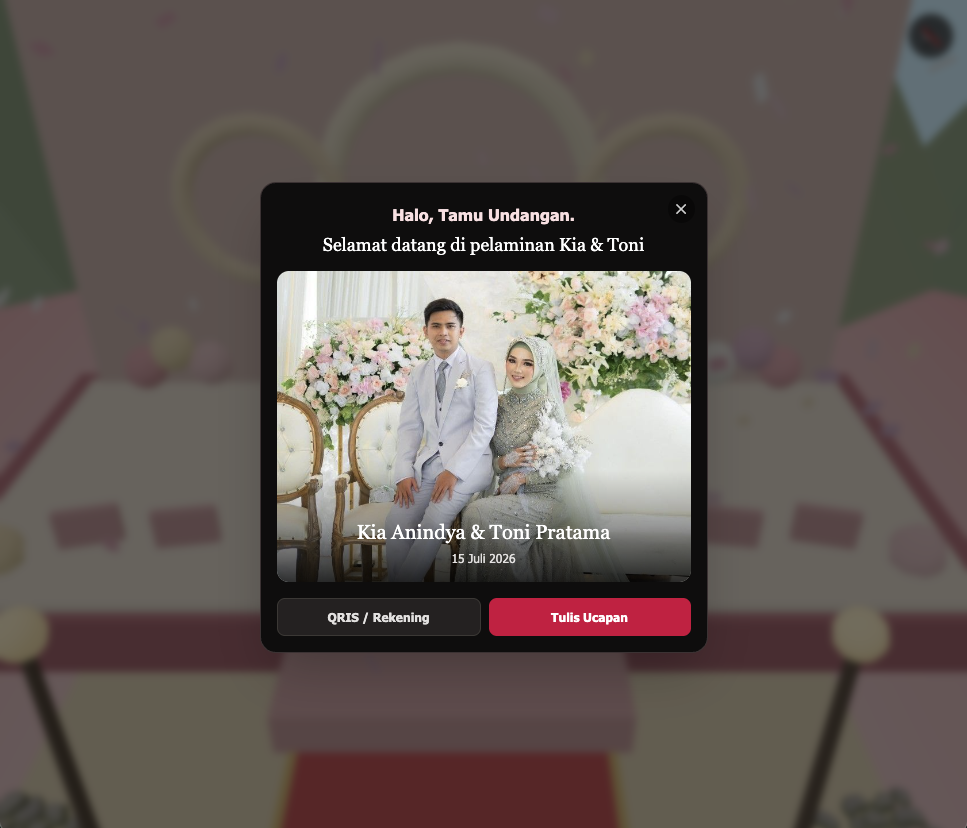

# Wedding Summer

Undangan pernikahan interaktif 3D — jelajahi venue, berinteraksi dengan NPC, dan tinggalkan ucapan di buku tamu.

Dibangun dengan **SvelteKit**, **Threlte** (Three.js), dan **Tailwind CSS**.

---

## Demo

### Tampilan Utama (Widescreen)



### Screenshot

| | |
|---|---|
|  |  |
|  |  |
|  |  |

> Semua screenshot tersedia di folder `static/documentation/`.

---

## Fitur

| Fitur | Deskripsi |
|---|---|
| **3D Walkthrough** | Pemain dapat berjalan menjelajahi venue pernikahan dalam tampilan third-person |
| **NPC Interaktif** | Resepsionis dan Pemandu Lokasi dengan dialog multi-halaman |
| **Buku Tamu** | Form ucapan & konfirmasi kehadiran tersimpan melalui Express API + MySQL |
| **Pelaminan** | Tampilan pengantin, foto, amplop digital (QRIS), dan confetti otomatis |
| **Kontrol Mobile** | Virtual joystick + tombol interaksi untuk layar sentuh |
| **Audio Latar** | Toggle musik latar (`static/audio/ambient.mp3`) |
| **Loading Screen** | Splash screen dengan progress bar saat aset dimuat |

---

## Stack Teknis

| Teknologi | Peran |
|---|---|
| [SvelteKit](https://kit.svelte.dev/) (Svelte 5 runes) | Framework UI & routing |
| [@threlte/core](https://threlte.dev/) + [@threlte/extras](https://threlte.dev/) | Declarative Three.js untuk Svelte |
| [Three.js](https://threejs.org/) | 3D rendering engine |
| [GSAP](https://greensock.com/gsap/) | Animasi 2D/3D |
| [Tailwind CSS](https://tailwindcss.com/) | Styling |
| [Vite](https://vitejs.dev/) | Build tool & dev server |
| adapter-static | Static site generation (SPA, SSR disabled) |

---

## Struktur Project

```
src/
├── App.svelte                          # Root component: Canvas + HUD + modals
├── app.css                             # Global styles (Tailwind + custom)
├── routes/
│   ├── +page.svelte                    # Mount App.svelte
│   ├── +layout.svelte                  # Import global CSS
│   └── +layout.ts                      # prerender=true, ssr=false
└── lib/
    ├── components/
    │   ├── threed/                     # Layer 3D
    │   │   ├── Scene.svelte            # Compositor + render loop (tick + proximity)
    │   │   ├── CameraRig.svelte        # Third-person follow camera
    │   │   ├── Lighting.svelte         # Hemisphere + directional light + shadows
    │   │   ├── Environment.svelte      # Venue, jalan, vegetasi, gunung
    │   │   ├── Nature.svelte           # Loader instanced glTF (pohon, batu, bunga)
    │   │   ├── Player.svelte           # Karakter pemain (Walk/Idle crossfade)
    │   │   ├── Character.svelte        # Karakter NPC generik (single clip)
    │   │   ├── Npcs.svelte             # Semua instance NPC (resepsionis, pemandu, pengantin)
    │   │   ├── Confetti.svelte         # Sistem partikel confetti
    │   │   └── Labels.svelte           # Label 2D yang diproyeksikan dari posisi 3D
    │   └── ui/                         # Layer UI (overlay 2D)
    │       ├── LoadingScreen.svelte    # Splash screen + progress bar
    │       ├── InteractionHint.svelte  # Tombol "Tekan E" saat dekat NPC/objek
    │       ├── NpcDialog.svelte        # Dialog NPC multi-halaman
    │       ├── GuestbookModal.svelte   # Form buku tamu
    │       ├── WeddingStageModal.svelte # Modal pelaminan + QRIS
    │       ├── MobileControls.svelte   # Virtual joystick + tombol E
    │       └── AudioPlayer.svelte      # Toggle musik latar
    ├── stores/
    │   ├── gameState.svelte.ts         # State global: modal, NPC data, confetti, guest name
    │   ├── playerMovement.svelte.ts    # Posisi, sudut, gerakan, tabrakan pemain
    │   └── labelStore.svelte.ts        # Definisi label 2D (posisi world → screen)
    ├── constants/
    │   └── triggers.ts                 # Trigger zones, colliders, geometri stage, konstanta
    ├── utils/
    │   ├── interaction.ts              # Deteksi proximity (Math.hypot)
    │   ├── toonMaterial.ts             # Gradient map 3-tone untuk MeshToonMaterial
    │   └── appearance.ts               # Kustomisasi warna karakter
    └── services/
        └── api.ts                      # Stub backend buku tamu (TODO: integrasi nyata)
```

---

## Aset 3D

### Model Karakter (`static/models/`)

| File | Kegunaan | Animasi |
|---|---|---|
| `tamu.gltf` | Karakter pemain | Idle, Walk, Run, Jump, Victory, +13 lainnya |
| `resepsionis.gltf` | NPC resepsionis | Idle |
| `pemandu.gltf` | NPC pemandu lokasi | Idle |
| `pengantin-wanita.gltf` | Kia (mempelai wanita) | Victory |
| `pengantin-pria.gltf` | Toni (mempelai pria) | Victory |

### Aset Alam (`static/nature/gltf/`)

Instanced glTF untuk vegetasi: `CommonTree`, `Pine`, `TwistedTree`, `Bush_Common`, `Flower_3_Group`, `Rock_Medium`, `Mushroom_Common`, `Fern`, `Clover`, `Pebble`, dan lainnya. Tekstur bark/leaf disertakan sebagai PNG.

---

## Kontrol

### Desktop

| Input | Aksi |
|---|---|
| `W` / `A` / `S` / `D` | Gerak maju/kiri/belakang/kanan |
| `Arrow Keys` | Alternatif gerak |
| `E` | Berinteraksi dengan NPC/objek terdekat |
| `Escape` | Tutup modal |

### Mobile

- **Virtual joystick** di kiri bawah layar untuk gerak
- **Tombol E** di kanan bawah saat dekat NPC/objek

---

## Sistem Interaksi

### Trigger Zones

Zona interaksi didefinisikan di `src/lib/constants/triggers.ts`:

```ts
{
  id: 'receptionist',
  label: 'Resepsionis',
  position: [0, 0, -4],     // posisi world (x, y, z)
  radius: 2.5,              // radius deteksi proximity
  action: 'npc',            // tipe modal: 'npc' | 'guestbook' | 'weddingStage'
  npcData: { ... }          // data dialog NPC (opsional)
}
```

**Zona yang tersedia:**

| ID | Label | Posisi | Radius | Aksi |
|---|---|---|---|---|
| `receptionist` | Resepsionis | `[0, 0, -4]` | 2.5 | NPC dialog |
| `mailbox` | Buku Tamu | `[-5, 0, -10]` | 2.2 | Guestbook form |
| `weddingStage` | Pelaminan | `[0, 0, -18]` | 3.5 | Wedding stage + confetti |
| `npcGuide` | Penunjuk Jalan | `[4, 0, -10]` | 2.2 | NPC dialog + Maps link |

### Alur Interaksi

1. Pemain bergerak mendekati objek
2. Sistem proximity (`interaction.ts`) mendeteksi trigger zone dalam radius
3. `InteractionHint` muncul dengan tombol "Tekan E"
4. Pemain menekan E → `openModal()` membuka modal sesuai `action`
5. Untuk `weddingStage`: confetti otomatis aktif
6. Tutup modal selalu via `closeModal()` untuk reset state

### Collision System

Collider berbentuk AABB didefinisikan di `triggers.ts`:

```ts
{ minX: -1.85, maxX: 1.85, minZ: -4.7, maxZ: -3.3 }  // meja resepsionis
```

Sistem collision di `playerMovement.svelte.ts` mendeteksi tabrakan dan memungkatkan pergerakan sumbu-demi-sumbu (slide along walls).

---

## Rendering & Visual

### Toon Shading

Semua material menggunakan `MeshToonMaterial` dengan gradient map 3-tone dari `toonMaterial.ts` untuk efek cel-shading lembut.

### Atmosfer

- Background: `#bfe3f0` (langit biru muda)
- Fog: `#fcd9a0` (kuning hangat), near=18, far=54
- Soft shadows via `@threlte/extras` `<SoftShadows>`
- Lampu-lampu dengan `MeshStandardMaterial` emissive

### Camera

Third-person follow camera dengan interpolasi halus (lerp factor 0.08) mengikuti posisi pemain.

---

## Perintah Development

```bash
# Install dependencies
npm install

# Jalankan dev server (Vite, hot reload)
npm run dev

# Typecheck (svelte-check)
npm run check

# Build produksi (static SPA → build/)
npm run build

# Preview build produksi
npm run preview
```

---

## Konfigurasi Build

- **Adapter**: `adapter-static` dengan fallback `index.html` (SPA)
- **SSR**: disabled (`+layout.ts`: `ssr = false`)
- **Prerender**: enabled (`prerender = true`)
- **Vite**: `ssr.noExternal` untuk three/threlte, `optimizeDeps` untuk three

---

## Kustomisasi

### Mengganti Data Pengantin

1. Edit nama di `WeddingStageModal.svelte` dan `LoadingScreen.svelte`
2. Ganti foto di `WeddingStageModal.svelte` (URL image)
3. Ganti model karakter di `static/models/`

### Mengubah Trigger Zone

Edit array `triggerZones` di `src/lib/constants/triggers.ts`. Pastikan posisi `position` sesuai dengan posisi objek 3D di `Environment.svelte` dan `Npcs.svelte`.

### Mengganti Musik

Taruh file audio di `static/audio/ambient.mp3`. Format: MP3, loop otomatis.

### Mengubah Vegetasi

Edit array posisi/scale di `Environment.svelte`. Model glTF alam tersedia di `static/nature/gltf/`.

### Warna Karakter

Kustomisasi via prop `appearance` di `Player.svelte`:

```svelte
<Player appearance={{
  skin: '#f0c8a0',
  hair: '#1a1a1a',
  shirt: '#ffffff',
  details: '#d4af37',
  shoes: '#1a1a1a'
}} />
```

---

## TODO Sebelum Produksi

- [x] Integrasi backend buku tamu dan dashboard admin melalui Express API + MySQL
- [ ] Ganti QRIS dan rekening di `WeddingStageModal.svelte` dengan data asli
- [ ] Ganti foto pengantin dengan foto asli
- [ ] Ganti URL Google Maps di `triggers.ts` dengan lokasi venue sebenarnya
- [ ] Optimasi ukuran model glTF jika diperlukan
- [ ] Tambahkan meta tags SEO dan Open Graph di `+layout.svelte` / `+head`

---

## Lisensi

Proyek ini bersifat privat dan dibuat untuk undangan pernikahan.
