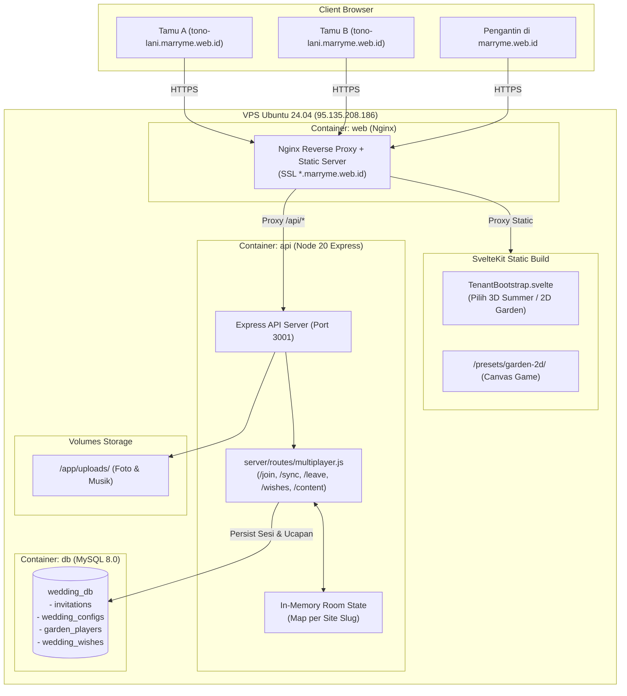
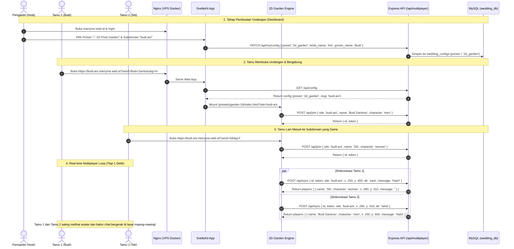

# Plan Implementasi: Our Little Wedding World (2D Pixel RPG) ke VPS marryme.web.id

> **Target:** 100% Self-Hosted di VPS (`95.135.208.186`), Docker Compose, Wildcard Subdomain (`*.marryme.web.id`), dan Real-time Multiplayer.

---

## 1. Jawaban & Klarifikasi: Mengapa Deploy ke VPS (Bukan Cloudflare)?

Folder `preset/our-little-wedding-world` aslinya adalah template bawaan OpenAI/Cloudflare yang memakai Cloudflare Workers + D1 (SQLite) + R2. 

**Kita 100% TIDAK menggunakan Cloudflare Pages/Workers untuk deployment ini.** 
Seluruh sistem berjalan secara **mandiri di VPS Anda** di dalam ekosistem Docker yang sudah aktif di `95.135.208.186`.

### Mengapa Deploy ke VPS Jauh Lebih Unggul?

1. **Multiplayer Penuh di Subdomain**:
   - Setiap pasangan pengantin mendapat subdomain sendiri (misal `tono-lani.marryme.web.id`, `budi-siti.marryme.web.id`).
   - Nginx Wildcard SSL (`*.marryme.web.id`) di VPS Anda otomatis merutekan semua subdomain ke sistem tanpa perlu setting DNS baru per pengantin.
   - Tamu di `tono-lani` akan bermain di "room/taman" khusus Tono & Lani, sementara tamu di `budi-siti` bermain di taman mereka sendiri (terisolasi per slug/subdomain).

2. **Real-time Synchronization (Avatar & Chat Bubble)**:
   - Backend Express (`server/routes/multiplayer.js`) di container `api` mengelola sinkronisasi posisi pemain, animasi jalan, gender avatar, dan pesan balon obrolan (chat bubble) secara cepat via in-memory state dengan backup persistensi ke MySQL.

3. **Satu Database & Media Terpusat**:
   - Menggunakan database MySQL `wedding_db` yang sudah ada di container `db` VPS (tabel `garden_players`, `wedding_wishes`, `wedding_configs`, `invitations`).
   - Foto pengantin dan galeri tersimpan langsung di folder volume `/uploads/` di VPS.

4. **Bebas Biaya Tambahan (Zero Cost)**:
   - Tidak ada kuota request Cloudflare D1/Workers. Semua memanfaatkan kapasitas RAM & CPU VPS Anda yang masih sangat lega.

---

## 2. Arsitektur Sistem di VPS Docker



---

## 3. Alur Kerja: Dari Pembuatan Undangan hingga Tamu Bermain Multiplayer



---

## 4. Komponen Teknis yang Telah Diintegrasikan

### A. Database Migration (`database/migrations/`)
- `012_preset_theme.sql`: Menambahkan kolom `preset` (`'3d_summer'` / `'2d_garden'`) pada tabel `wedding_configs`.
- `013_multiplayer_players.sql`: Menambahkan tabel `garden_players` (sesi pemain aktif) dan `wedding_wishes` (buku tamu/ucapan 2D garden).

### B. Backend API (`server/routes/multiplayer.js`)
- `POST /api/join` & `POST /api/multiplayer/join`: Registrasi pemain baru dengan UUID + token.
- `POST /api/sync` & `POST /api/multiplayer/sync`: Sinkronisasi posisi (x, y, arah gerak) dan pesan chat bubble antar pemain di `site` (subdomain) yang sama.
- `POST /api/leave` & `POST /api/multiplayer/leave`: Bersihkan sesi saat pemain keluar / close tab.
- `POST /api/wishes/send` & `POST /api/wishes/list`: Kirim dan ambil daftar ucapan doa.
- `GET /api/content` & `GET /api/multiplayer/content`: Mengambil detail acara, foto pengantin, musik, rekening amplop digital dari database pengantin.

### C. Frontend Preset (`static/presets/garden-2d/`)
- Seluruh aset retro pixel art (karakter pria & wanita, map taman, air mancur, musisi piano & penyanyi, gerbang, background venue) diletakkan di folder statis.
- `cms-bootstrap.js` otomatis mendeteksi subdomain aktif (`budi-ani`) dan mengambil data pengantin dari API VPS.
- Jika API sedang offline/dev, otomatis fallback mulus ke konfigurasi default.

### D. Switcher Preset SvelteKit (`src/lib/components/tenant/TenantBootstrap.svelte`)
- Jika `preset === '2d_garden'` → Otomatis me-mount `Garden2DApp.svelte` (Canvas 2D Pixel Garden).
- Jika `preset === '3d_summer'` → Otomatis me-mount `App.svelte` (Dunia 3D Three.js Summer Island).
- Pengguna bebas memilih tema kapan saja di Dashboard pengaturan tanpa kehilangan data undangan.

---

## 5. Fitur Interaktif di dalam 2D Pixel Garden

| Venue / Titik Interaksi | Lokasi di Taman | Deskripsi & Fungsi |
|---|---|---|
| **1. Selamat Datang** | Pintu Masuk Bawah | Menyapa tamu dengan nama terpersonalisasi (`?send=Nama+Tamu`). |
| **2. Panggung Akad & Resepsi** | Panggung Utama (Atas) | Menampilkan jadwal akad & resepsi, alamat gedung, dan tombol Buka Google Maps. |
| **3. Buku Ucapan Bahagia** | Gazebo Kiri Atas | Tamu dapat menuliskan pesan doa restu yang langsung terbaca oleh tamu lain. |
| **4. Cerita Kisah Cinta** | Bangku Taman Kiri Bawah | Menampilkan timeline perjalanan cinta kedua mempelai. |
| **5. Hadiah & Amplop Digital** | Meja Kado Kanan Atas | Menampilkan nomor rekening bank pengantin (fitur copy otomatis) dan alamat kirim kado. |
| **6. Galeri Foto Kenangan** | Pohon Kenangan Kanan Bawah | Menampilkan galeri carousel foto prewedding kedua mempelai. |
| **7. Musisi & Air Mancur** | Tepi Danau | Animasi pianis & penyanyi yang bermain musik saat lagu pernikahan diputar. |

---

## 6. Prosedur Deploy ke VPS (`root@95.135.208.186`)

Semua perubahan sudah divalidasi lokal (`npm run check` lulus 0 error, `npm run build` sukses 100%).

### Langkah Eksekusi Deployment:

```bash
# 1. Commit dan push ke branch staging / new_staging
git add .
git commit -m "feat: integrate 2d pixel garden preset with full multiplayer on vps docker"
git push origin new_staging

# 2. Di VPS (otomatis via deploy script atau manual):
cd /opt/wedding-summer
git pull origin new_staging
docker compose up -d --build
```

### Validasi Pasca Deploy:
1. Buka `https://marryme.web.id` → Login ke dashboard → Coba pilih preset **🌿 2D Pixel Garden RPG**.
2. Buka URL subdomain undangan di 2 perangkat / tab browser berbeda:
   - Tab 1: `https://[subdomain].marryme.web.id?send=Tamu+1&g=m`
   - Tab 2: `https://[subdomain].marryme.web.id?send=Tamu+2&g=f`
3. Gerakkan karakter di Tab 1 dengan tombol panah/WASD atau joystick ponsel → Amati avatar di Tab 2 bergerak secara real-time!
4. Ketik ucapan di menu chat / buku tamu → Balon chat akan muncul di atas kepala karakter.
